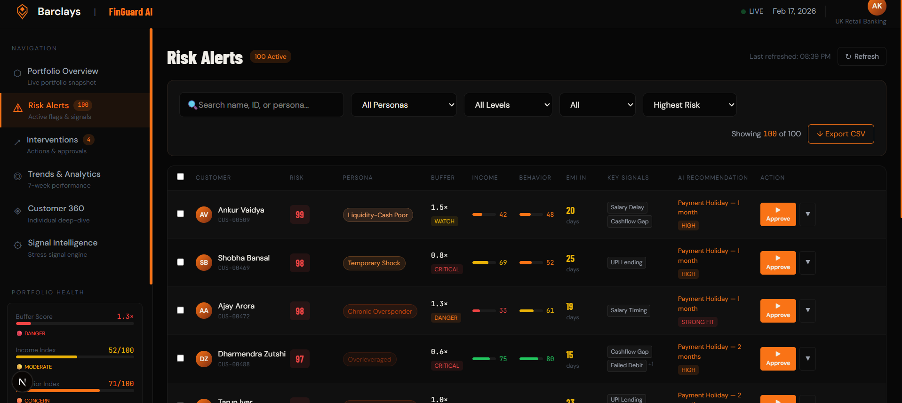
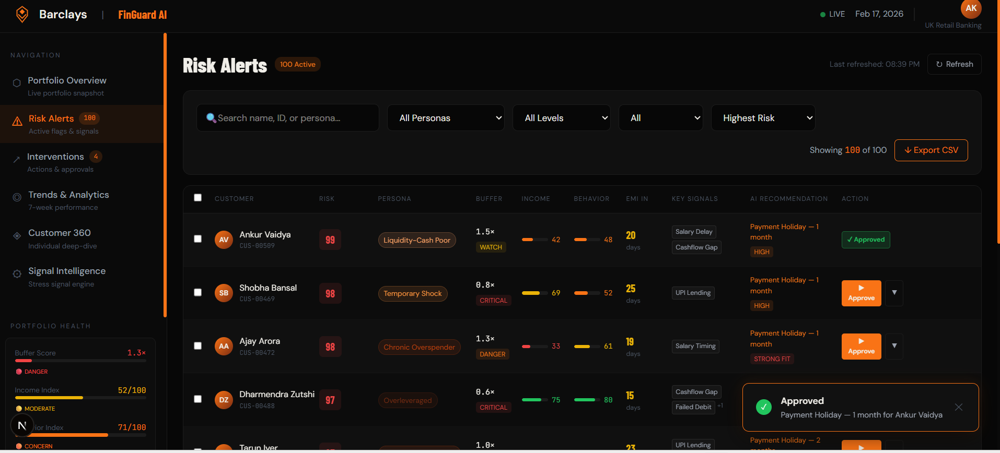
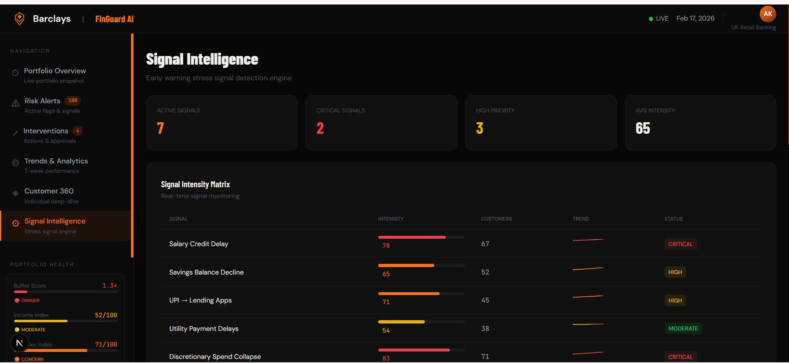

# 
🛡️ FinGuard AI

<b>Predictive Risk Intelligence for Modern Banking</b>

  
  
  

---

## 🏛️ Project Vision
**FinGuard AI** is a professional-grade predictive risk dashboard designed to transform reactive credit monitoring into a proactive prevention strategy. By leveraging real-time stress signals and explainable AI, it empowers risk managers to identify and mitigate credit defaults before they occur.

## 🖼️ Visual Showcase

### 📊 Intelligence at a Glance
Experience a powerful, high-fidelity interface designed for deep financial analysis and real-time monitoring of portfolio health.

  

### 🔍 Risk Monitoring & Explainability
Move beyond black-box scores. FinGuard provides granular transparency into *why* a customer is flagged, powered by SHAP feature importance.

  
  

### ◈ Behavioral Deep-Dives
Drill down into individual customer journeys, behavioral heatmaps, and transaction stress signals.

  
  

### ↗ Targeted Interventions & Governance
Automated approval workflows and comprehensive reporting ensure that every risk mitigation step is logged and auditable.

  
  

---

## 🏛️ System Architecture

FinGuard AI utilizes a resilient architecture designed for 100% availability and data integrity, even in unstable network environments.

### 🛡️ Resilient Data Layer
At the core of the application is a custom **Firestore Resilience Proxy**. This layer handles all database interactions with an automatic fallback mechanism:
- **gRPC Sanitization**: Aggressively cleans environment variables to ensure 100% compatibility with production gRPC metadata requirements.
- **Dynamic Failover**: Detects `NOT_FOUND` or `SERVICE_DISABLED` events at the SDK level and transparently redirects operations to an optimized **In-Memory Session Store**.
- **Context Integrity**: Explicit method delegation maintains the integrity of the Firebase Admin SDK while providing a failsafe interface.

### 📈 Predictive Intelligence Engine
The dashboard processes behavioral signals to calculate granular risk scores:
- **Stress Signal Tracking**: Monitoring salary credit delays, discretionary spend collapse, and stress-borrowing through UPI patterns.
- **Explainable AI (XAI)**: Every risk alert is accompanied by SHAP-driven feature importance, providing deep transparency into the model's decision-making process.

---

## ✨ Enterprise Features

### 🔍 Risk Monitoring & Alerts
A high-performance datagrid featuring 100+ active records with real-time horizontal and vertical filtering.

### ↗ Automated Intervention Lifecycle
AI-driven recommendations for proactive risk mitigation:
- **Strategic Relief**: Automated suggestions for Payment Holidays and EMI Restructuring.
- **ROI Projections**: Each intervention displays estimated prevented loss vs. campaign cost.
- **Audit Logging**: All interactions are logged with unique IDs for downstream auditability.

### 🎨 Design System & UX
- **Corporate Dark Aesthetics**: Optimized for high-focus environments using a curated color palette (Barclays secondary orange, sleek charcoal, and status-saturated signals).
- **Atomic UI Architecture**: A proprietary component library built for speed, consistency, and accessible data visualization.

---

## 🛠 Technical Specification

- **Frontend**: Next.js 15+ (App Router), TypeScript, Tailwind CSS 4
- **Backend**: Node.js API Routes with resilient Firebase Admin integration
- **Visuals**: Framer Motion, Recharts, and Custom SVG Data Gauges

---

  <i>FinGuard AI is a demonstration of enterprise-grade resilient engineering. Designed for performance, built for impact.</i>

